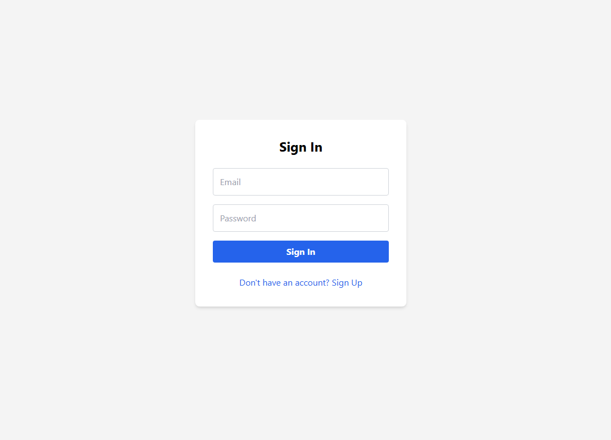
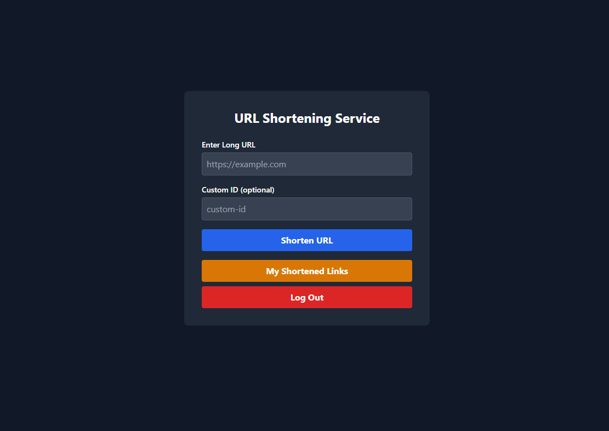
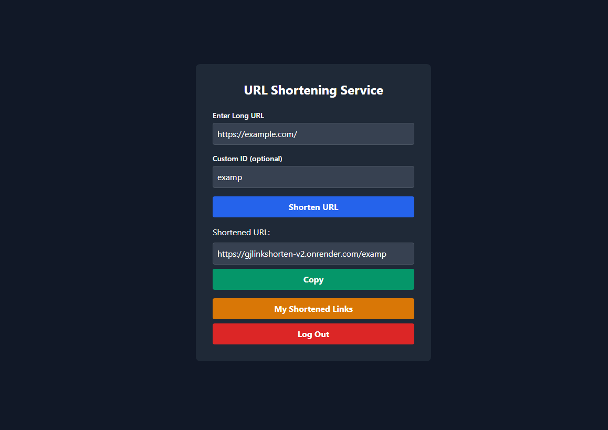
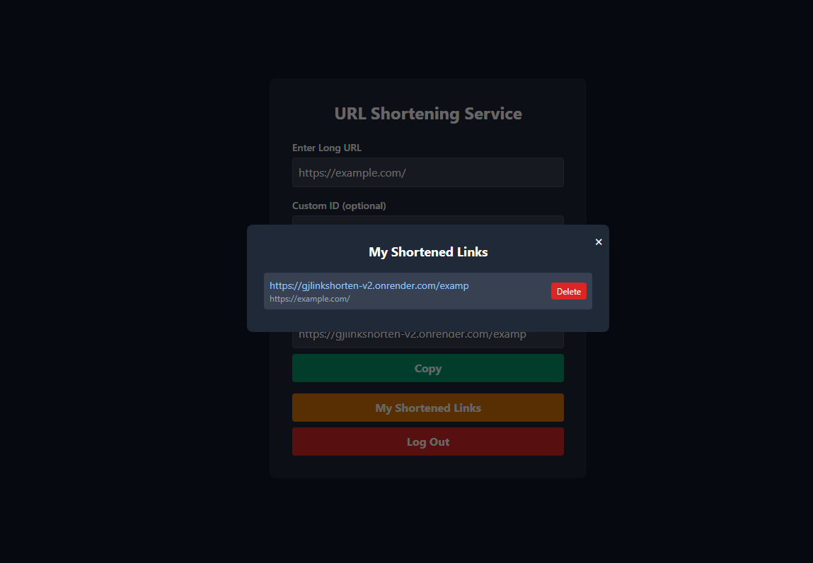

# 🔗 GJlinkshorten-v2

Welcome to **GJlinkshorten-v2**! This is a simple and modern URL shortener web application. Easily shorten your long URLs and manage them with an intuitive interface.

## ⚙️ Authentication & Login System

GJlinkshorten-v2 features a secure login and registration system powered by Firebase Authentication. Users can create an account or log in with their credentials to access personalized features:

- 🔑 **Register & Login:** Sign up with your email and password, or log in to your existing account.
- 🗂️ **Personal Dashboard:** Each user can view and manage their own shortened URLs.
- 🕒 **Session Management:** Secure sessions ensure your data is protected while you use the app.
- ❌ **Logout:** Easily log out to keep your account safe.

All authentication logic is handled in the backend and integrated with the frontend for a seamless user experience.

## 🚀 Features
- Shorten long URLs quickly
- User authentication (register/login)
- Expired URL auto-deletion
- Clean and modern UI
- Firebase integration for backend

## 🛠️ Technologies Used
- **Node.js**
- **Express.js**
- **Firebase** (Authentication & Database)
- **HTML5 & CSS3**
- **JavaScript (ES6+)**


## 📸 Screenshots

Below you can see some example screenshots of the application:

### Home Page


### Auth Page


### URL List


### Success Message


## 📂 Project Structure
```
├── authController.js
├── authRoutes.js
├── controllers.js
├── deleteExpiredUrls.js
├── firebase.js
├── index.js
├── package.json
├── public/
│   ├── auth.html
│   ├── auth.js
│   ├── index.html
│   └── main.js
├── img/
│   ├── ss1.png
│   ├── ss2.png
│   ├── ss3.png
│   └── ss4.png
└── ...
```

## ⚡ Getting Started
1. **Clone the repository:**
   ```sh
   git clone <repo-url>
   ```
2. **Install dependencies:**
   ```sh
   npm install
   ```
3. **Configure Firebase:**
   - Update your Firebase credentials in `firebase.js`.
4. **Run the app:**
   ```sh
   node index.js
   ```
5. **Open in browser:**
   - Navigate to `http://localhost:3000`

## 🙌 Contributing
Pull requests are welcome! For major changes, please open an issue first to discuss what you would like to change.

## 📄 License
This project is licensed under the MIT License.

---

Enjoy using GJlinkshorten-v2! 🔥
